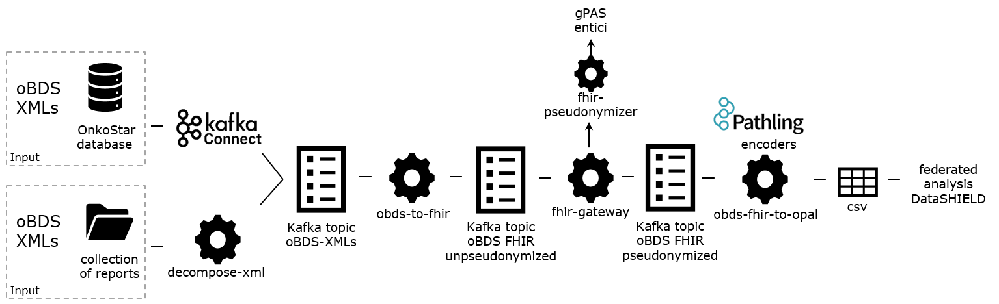

# onco-analytics-on-fhir Docker Compose Version



#### Citation
If you use this work, please cite:

Ziegler J, Erpenbeck MP, Fuchs T, Saibold A, Volkmer PC, Schmidt G, Eicher J, Pallaoro P, De Souza Falguera R, Aubele F, Hagedorn M, Vansovich E, Raffler J, Ringshandl S, Kerscher A, Maurer JK, Kühnel B, Schenkirsch G, Kampf M, Kapsner LA, Ghanbarian H, Spengler H, Soto-Rey I, Albashiti F, Hellwig D, Ertl M, Fette G, Kraska D, Boeker M, Prokosch HU, Gulden C
Bridging Data Silos in Oncology with Modular Software for Federated Analysis on Fast Healthcare Interoperability Resources: Multisite Implementation Study
J Med Internet Res 2025;27:e65681
[doi: 10.2196/65681](https://doi.org/10.2196/65681) PMID: 40233352 PMCID: 12041822

## Installation

### 1. Prepare Data Import

#### a) ONKOSTAR data base connector

Configure kafka-connect in [compose.kafka.yaml](compose.kafka.yaml) and [docker-compose/kafka-connect-passwords.properties](kafka-connect-passwords.properties).
The oBDS single report XML-files will be loaded into the Kafka cluster.
For more information about kafka-connect, refer to [7. Enable Kafka Connect and the connector.](#7-enable-kafka-konnect-and-the-connector)

#### b) Folder import

Copy your oBDS collection report XML-files to [docker-compose/input-obds-reports]().

### 2. Start the Kafka Cluster

```sh
docker compose -f compose.kafka.yaml up
```

Open <http://localhost:8084/> to view the cluster's topics and the progress of your pipeline.

### 3. Load data

#### a) ONKOSTAR data base connector

The oBDS single report XML-files from the ONKOSTAR database will be loaded into the Kafka cluster with step 2.

#### b) Folder import

Decompose oBDS collection report XML-files from [docker-compose/input-obds-reports](input-obds-reports) into single XML reports and load them into the Kafka cluster.

```sh
USER_ID=${UID} GROUP_ID=${GID} docker compose -f compose.decompose-xmls.yaml up
```

The `USER_ID` and `GROUP_ID` env vars are used to make the container run as the current user,
assuming the [docker-compose/output-obds-reports](output-obds-reports) is owned by them.

### 4. Transform oBDS XML-data to FHIR

```sh
docker compose -f compose.obds-to-fhir.yaml up
```

We currently use the FHIR profiles defined under <https://simplifier.net/oncology>.

Note that this streaming job runs indefinitely. You can check the progress via akhq at <http://localhost:8084/>.
There should be 4 messages in both the `fhir.obds.Patient` and `fhir.obds.Condition` topics respectively.

You can then shutdown the job using Ctrl+C.

### 5. Load the FHIR resources as Delta Lake tables in MinIO

This assumes that Kafka already contains the `fhir.obds.*` topics and starts both MinIO to store the Delta tables and [fhir-to-lakehouse](https://github.com/bzkf/fhir-to-lakehouse):

```sh
docker compose --env-file=.demo.env -f compose.fhir-to-delta.yaml up
```

To change the default password used by MinIO, please modify the [.demo.env](.demo.env) or provide an alternative .env file.

### 6. Convert the FHIR resources to a CSV dataset

```sh
sudo chown -R 1001:1001 ./opal-output/
docker compose -f compose.obds-fhir-to-opal.yaml up
```


### 7. Enable Kafka Connect and the connector

Make sure to have access to Onkostar tables `lkr_meldung`, `lkr_meldung_export` and `erkrankung`.

The following SQL query will SELECT required information with columns filtered by type and containing required ICD_Version entry in `XML_DATEN`:

```sql
SELECT * FROM (
  SELECT YEAR(STR_TO_DATE(EXTRACTVALUE(lme.xml_daten, '//Diagnosedatum'), '%d.%c.%Y')) AS YEAR, versionsnummer AS VERSIONSNUMMER, lme.id AS ID, CONVERT(lme.xml_daten using utf8) AS XML_DATEN
    FROM lkr_meldung_export lme
    WHERE lme.typ != '-1' AND lme.versionsnummer IS NOT NULL AND lme.XML_DATEN LIKE '%ICD_Version%'
) o
```

To remove leading zeros from `Patient_ID` (see: https://github.com/bzkf/onco-analytics-on-fhir/issues/188), you could use the following query.
It will update `XML_DATEN` by replacing the attribute `Patient_ID` by using an `INT` if the value found can be casted into an integer but keeps the original value
if any other (e.g. alphanumeric value) is used and the cast will result in `0` value.

```sql
SELECT * FROM (
    SELECT
        YEAR(STR_TO_DATE(EXTRACTVALUE(lme.xml_daten, '//Diagnosedatum'), '%d.%c.%Y')) AS YEAR,
        versionsnummer AS VERSIONSNUMMER,
        lme.id AS ID,
        CASE
        # Patient_ID can be casted into number
            WHEN CAST(EXTRACTVALUE(lme.xml_daten, '//Patienten_Stammdaten/@Patient_ID') AS INT) > 0
            THEN CONVERT(
                UPDATEXML(
                    lme.xml_daten,
                    '//Patienten_Stammdaten/@Patient_ID',
                    CONCAT('Patient_ID="', EXTRACTVALUE(lme.xml_daten, '//Patienten_Stammdaten/@Patient_ID'),'"')
                ) USING utf8
            )
        ELSE
        # else fallback - do not touch Patient_ID
            CONVERT(lme.xml_daten USING UTF8)
        END AS XML_DATEN
    FROM lkr_meldung_export lme
    WHERE
        typ != '-1'
        AND versionsnummer IS NOT NULL
        AND lme.XML_DATEN LIKE '%ICD_Version%'
        AND EXTRACTVALUE(lme.xml_daten, '//ADT_GEKID/@Schema_Version') LIKE '2.%'
) o
```

If you are not using direct access to Onkostar MySQL/MariaDB database, you should use the following query that will fetch
the diagnosis date from table `erkrankung`, because function `EXTRACTVALUE()` to extract values from XML is only
supported on MySQL and MariaDB.
This will require `JOIN`ing tables `lkr_meldung` and `erkrankung`.

```sql
SELECT * FROM (
  SELECT YEAR(e.diagnosedatum) AS YEAR, versionsnummer AS VERSIONSNUMMER, lme.id AS ID, CONVERT(lme.xml_daten using utf8) AS XML_DATEN
    FROM lkr_meldung_export lme
    JOIN lkr_meldung lm ON lme.lkr_meldung = lm.id
    JOIN erkrankung e ON lm.erkrankung_id = e.id
    WHERE lme.typ != '-1' AND lme.versionsnummer IS NOT NULL AND lme.XML_DATEN LIKE '%ICD_Version%'
) o
```

```sh
docker compose -f compose.obds-to-fhir.yaml -f compose.kafka.yaml up
```

```sh
curl -X POST \
  -H 'Content-Type: application/json' \
  -d @onkostar-db-connector.json \
  http://localhost:8083/connectors
```

### 8. Run with enabled pseudonymization

> **Warning**
> Requires gPAS to be set-up and the [anonymization.yaml](anonymization.yaml) to be configured

```sh
docker compose -f compose.obds-to-fhir.yaml -f compose.kafka.yaml -f compose.pseudonymization.yaml up
```

### 9. Run with enabled pseudonymization and sending resources to a FHIR server

```sh
docker compose -f compose.obds-to-fhir.yaml -f compose.kafka.yaml -f compose.fhir-server.yaml -f compose.pseudonymization.yaml up
```

### 10. Air-gapped installation

In case of absence of Internet connectivity, container images cannot be pulled from the registry. Instead, download the air-gapped installer and move it to the deployment machine:

<!-- x-release-please-start-version -->

```sh
curl -L -O https://github.com/bzkf/onco-analytics-on-fhir/releases/download/v2.2.2/air-gapped-installer.tgz
```

<!-- x-release-please-end -->

Run the following steps on the deployment machine.

Extract the archive:

```sh
tar xvzf ./air-gapped-installer.tgz
```

## Customize any compose file

The easiest way to configure any settings or environment variables of the compose files is to merge them with customized ones: <https://docs.docker.com/compose/how-tos/multiple-compose-files/merge/>.

For example, to modify the configuration of the [compose.pseudonymization.yaml](compose.pseudonymization.yaml) file you can create an override file called [compose.pseudonymization.overrides.yaml](compose.pseudonymization.yaml) like this one:

```yaml
services:
  fhir-pseudonymizer:
    environment:
      gPAS__Url: "https://gpas.example.com/ttp-fhir/fhir/gpas/"
      gPAS__Auth__Basic__Username: "user"
      gPAS__Auth__Basic__Password: ${FHIR_PSEUDONYMIZER_GPAS_AUTH_BASIC_PASSWORD:?}
```

and run it like so:

```sh
docker compose --env-file=.demo.env -f compose.pseudonymization.yaml -f compose.pseudonymization.overrides.yaml up
```

this assumes that the `FHIR_PSEUDONYMIZER_GPAS_AUTH_BASIC_PASSWORD` env var is set in the .demo.env file.
