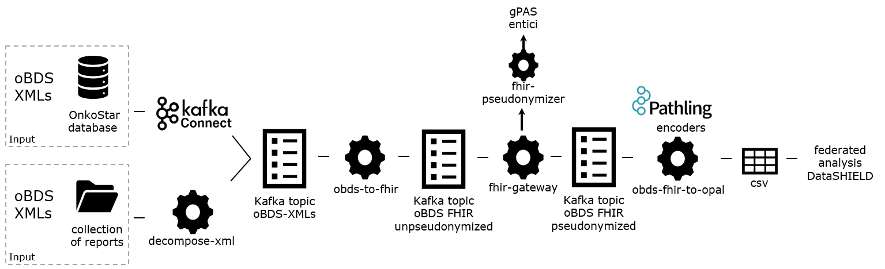

# onco-analytics-on-fhir Docker Compose Version



## Citation

If you use this work, please cite:

Ziegler J, Erpenbeck MP, Fuchs T, Saibold A, Volkmer PC, Schmidt G, Eicher J, Pallaoro P, De Souza Falguera R, Aubele F, Hagedorn M, Vansovich E, Raffler J, Ringshandl S, Kerscher A, Maurer JK, Kühnel B, Schenkirsch G, Kampf M, Kapsner LA, Ghanbarian H, Spengler H, Soto-Rey I, Albashiti F, Hellwig D, Ertl M, Fette G, Kraska D, Boeker M, Prokosch HU, Gulden C
Bridging Data Silos in Oncology with Modular Software for Federated Analysis on Fast Healthcare Interoperability Resources: Multisite Implementation Study
J Med Internet Res 2025;27:e65681
[doi: 10.2196/65681](https://doi.org/10.2196/65681) PMID: 40233352 PMCID: 12041822

## Installation

### 1. Prepare Data Import

#### a) ONKOSTAR data base connector

Configure kafka-connect in [onkostar-db-connector.json](onkostar-db-connector.json) and [kafka-connect-passwords.properties](kafka-connect-passwords.properties).
The oBDS single report XML-files will be loaded into the Kafka cluster.
For more information about kafka-connect, refer to "Enable Kafka Connect and the connector" below.

#### b) Folder import

Copy your oBDS collection report XML-files to [./input-obds-reports](./input-obds-reports).

### 2. Start the Kafka Cluster

```sh
docker compose -f compose.kafka.yaml up
```

Open <http://localhost:8084/> to view the cluster's topics and the progress of your pipeline.

### 3. Load data

#### a) ONKOSTAR data base connector

The oBDS single report XML-files from the ONKOSTAR database will be loaded into the Kafka cluster with step 2.

#### b) Folder import

The obds-to-fhir job directly reads oBDS reports from the [./input-obds-reports](./input-obds-reports) folder
and writes the mapped FHIR resources to the `fhir.obds.bundles` Kafka topic and the [output-obds-reports](output-obds-reports)
folder as files.

```sh
USER_ID=${UID} GROUP_ID=${GID} docker compose -f compose.obds-to-fhir.yaml -f compose.overrides.obds-to-fhir-from-directory.yaml up
```

> [!TIP]
> You can add `--env-file=.demo.env` after the `docker compose` above to run it using the
> demo configuration which reads the sample reports from [./demo-obds-reports](./demo-obds-reports).

The `USER_ID` and `GROUP_ID` env vars are used to make the container run as the current user,
which allows writing the output back to [output-obds-reports](output-obds-reports).

### 4. Transform oBDS XML-data to FHIR

> [!NOTE]
> not required if you did 3 b) before, which should alread have written the FHIR resources to
> Kafka and the output folder.

```sh
docker compose -f compose.obds-to-fhir.yaml up
```

Note that this streaming job runs indefinitely. You can check the progress via akhq at <http://localhost:8084/>.
There should be messages in the `fhir.obds.bundles` topic.

You can then shutdown the job using Ctrl+C.

> [!IMPORTANT]
> For more information about this ETL job, see <https://github.com/bzkf/obds-to-fhir>

### 5. Load the FHIR resources as Delta Lake tables in MinIO

This assumes that Kafka already contains the `fhir.obds.bundles` topics and starts both MinIO to store the Delta tables and [fhir-to-lakehouse](https://github.com/bzkf/fhir-to-lakehouse):

```sh
docker compose -f compose.fhir-to-delta.yaml up
```

> [!TIP]
> You can add `--env-file=.demo.env` after the `docker compose` above to run it using the
> demo configuration.

### 6. Convert the FHIR resources to a CSV dataset (analytics-on-fhir)

```sh
sudo chown -R 65532:65532 ./opal-output/
docker compose -f compose.analytics-on-fhir.yaml up
```

### 7. Enable Kafka Connect and the connector

Make sure to have access to Onkostar tables `lkr_meldung_export`.

Run the command below to start Kafka and Kafka connect (if not already running):

```sh
docker compose -f compose.kafka.yaml up
```

Next, enable the connector [onkostar-db-connector.json](onkostar-db-connector.json). If required,
you can modify the SQL query to suit your needs by modifying the file.

```sh
curl -X POST \
  -H 'Content-Type: application/json' \
  -d @onkostar-db-connector.json \
  http://localhost:8083/connectors
```

To remove leading zeros from `Patient_ID` (see: <https://github.com/bzkf/onco-analytics-on-fhir/issues/188>), you could use the following query.
It will update `XML_DATEN` by replacing the attribute `Patient_ID` by using an `INT` if the value found can be casted into an integer but keeps the original value
if any other (e.g. alphanumeric value) is used and the cast will result in `0` value.

```sql
SELECT * FROM (
    SELECT
        YEAR(STR_TO_DATE(EXTRACTVALUE(lme.xml_daten, '//Diagnosedatum'), '%d.%c.%Y')) AS YEAR,
        versionsnummer AS VERSIONSNUMMER,
        lme.id AS ID,
        CASE
        # Patient_ID can be casted into number
            WHEN CAST(EXTRACTVALUE(lme.xml_daten, '//Patienten_Stammdaten/@Patient_ID') AS INT) > 0
            THEN CONVERT(
                UPDATEXML(
                    lme.xml_daten,
                    '//Patienten_Stammdaten/@Patient_ID',
                    CONCAT('Patient_ID="', EXTRACTVALUE(lme.xml_daten, '//Patienten_Stammdaten/@Patient_ID'),'"')
                ) USING utf8
            )
        ELSE
        # else fallback - do not touch Patient_ID
            CONVERT(lme.xml_daten USING UTF8)
        END AS XML_DATEN
    FROM lkr_meldung_export lme
    WHERE
        typ != '-1'
        AND versionsnummer IS NOT NULL
) o
```

### 8. Run with enabled pseudonymization

> [!IMPORTANT]
> Requires gPAS or another pseudonymization to be set-up
> and an `anonymization.yaml` to be configured.

```sh
docker compose -f compose.obds-to-fhir.yaml -f compose.kafka.yaml -f compose.pseudonymization.yaml up
```

### 9. Run with enabled pseudonymization and sending resources to a FHIR server

```sh
docker compose -f compose.obds-to-fhir.yaml -f compose.kafka.yaml -f compose.fhir-server.yaml -f compose.pseudonymization.yaml up
```

## Customize any compose file

The easiest way to configure any settings or environment variables of the compose files is to merge them with customized ones: <https://docs.docker.com/compose/how-tos/multiple-compose-files/merge/>.

For example, to modify the configuration of the [compose.pseudonymization.yaml](compose.pseudonymization.yaml) file you can create an override file called [compose.pseudonymization.overrides.yaml](compose.pseudonymization.yaml) like this one:

```yaml
services:
  fhir-pseudonymizer:
    environment:
      gPAS__Url: "https://gpas.example.com/ttp-fhir/fhir/gpas/"
      gPAS__Auth__Basic__Username: "user"
      gPAS__Auth__Basic__Password: ${FHIR_PSEUDONYMIZER_GPAS_AUTH_BASIC_PASSWORD:?}
```

and run it like so:

```sh
docker compose --env-file=.demo.env -f compose.pseudonymization.yaml -f compose.pseudonymization.overrides.yaml up
```

this assumes that the `FHIR_PSEUDONYMIZER_GPAS_AUTH_BASIC_PASSWORD` env var is set in the .demo.env file.
